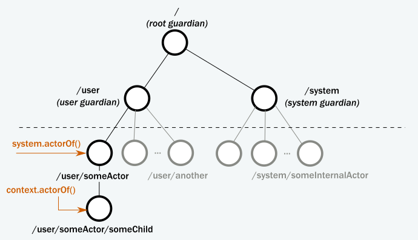

### AKKA 
-------
# Why modern systems need a new programming model
[ref](https://doc.akka.io/docs/akka/2.5/guide/actors-motivation.html)

traditional programming assumptions and the reality of modern multi-threaded, multi-CPU architectures 传统编程设定和当下多线程多CPU的架构的差异：
* challenge of encapsulation 封装的挑战
  方法封装在类的内部，多线程调用可能产生任意结果.常用方式是加锁，
	+ 限制了并行度，现代CPU架构挂起和恢复线程消耗大
	+ 调用线程会被阻塞，除非启动新的线程
	+ 可能造成死锁
	+ 分布式中锁会造成性能瓶颈
* The illusion of shared memory on modern computer architectures
  + There is no real shared memory anymore, CPU cores pass chunks of data (cache lines) explicitly to each other just as computers on a network do. Inter-CPU communication and network communication have more in common than many realize. Passing messages is the norm now be it across CPUs or networked computers.
  + Instead of hiding the message passing aspect through variables marked as shared or using atomic data structures, a more disciplined and principled approach is to keep state local to a concurrent entity and propagate data or events between concurrent entities explicitly via messages.
  
* The illusion of a call stack

[Akka Quickstart with scala](https://developer.lightbend.com/guides/akka-quickstart-scala)
## actor模型 
actor是响应式和消息驱动的
`Actors are reactive and message driven`
---
* Event-driver model
* Strong isolation principles
* Location transparency
* Lightweight
----
# Defining Actors and messages
  Messages可以是任意类型，可以是boxed primitive values， 或者plain data；  scala的case class和case object很适合作为消息，因为他们不可变而且支持模式匹配；定义消息建议考虑一下几点：
  1. 消息是actor之间的公共API，名称定义要清晰
  2. 消息应该是不可变的，因为它们被不同的线程共享
  3. 把消息放在actor的伴生对象内部是个好习惯，让我们清楚actor预期接受和处理的消息是什么
  4. It is also a common pattern to use a props method in the companion object that describes how to construct the Actor.
 
```scala
class Greeter(message: String, printerActor: ActorRef) extends Actor {
  import Greeter._
  import Printer._

  var greeting = ""

  def receive = {
    case WhoToGreet(who) =>
      greeting = message + ", " + who
    case Greet           =>
      printerActor ! Greeting(greeting)
  }
}

object Greeter {
  def props(message: String, printerActor: ActorRef): Props = Props(new Greeter(message, printerActor))
  final case class WhoToGreet(who: String)
  case object Greet
}
```
Actor可以包含状态(greeting)，状态在Actor模型中是线程安全的。

# The power of location transparency:
* akka中不是通过new关键字创建actor实例，而是通过factory创建，同时返回的并不是actor实例对象而是 `akka.actor.ActorRef`引用。这为分布式系统提供了高伸缩性
* location transparency 意味着ActorRef可以指向任意（进程内或远端）运行的Actor

The Akka ActorSystem
* `akka.actor.ActorSystem`factory在某种意义上类似Spring的`BeanFactory`. 它扮演者actor的容器并管理着它们的生命周期
* 创建actor需要两个参数： 参数对象`Props`和'name'

```scala
// Create the printer actor
val printer: ActorRef = system.actorOf(Printer.props, "printerActor")

// Create the 'greeter' actors
val howdyGreeter: ActorRef =
  system.actorOf(Greeter.props("Howdy", printer), "howdyGreeter")
val helloGreeter: ActorRef =
  system.actorOf(Greeter.props("Hello", printer), "helloGreeter")
val goodDayGreeter: ActorRef =
  system.actorOf(Greeter.props("Good day", printer), "goodDayGreeter")
```

# Asynchronous communication
* Actor接收到消息后进程处理，处理是异步进行的；同一个Actor到recipient的消息顺序被保留(preserved)，但是会和其他actor的消息交叉(interleaved)

~ Sending messages to an Actor
use `!`(bang) method


# Testing Actors

```scala
package $package$

import org.scalatest.{ BeforeAndAfterAll, WordSpecLike, Matchers }
import akka.actor.ActorSystem
import akka.testkit.{ TestKit, TestProbe }  // akka自带的测试组件
import scala.concurrent.duration._
import scala.language.postfixOps
import Greeter._
import Printer._

class AkkaQuickstartSpec(_system: ActorSystem)
  extends TestKit(_system)
  with Matchers
  with WordSpecLike
  with BeforeAndAfterAll {

  def this() = this(ActorSystem("AkkaQuickstartSpec"))

  override def afterAll: Unit = {
    shutdown(system) // 测试组件清理
  }

  "A Greeter Actor" should {
    "pass on a greeting message when instructed to" in {
      val testProbe = TestProbe() // 用于检查消息是否发送的组件
      val helloGreetingMessage = "hello"
      val helloGreeter = system.actorOf(Greeter.props(helloGreetingMessage, testProbe.ref))
      val greetPerson = "Akka"
      helloGreeter ! WhoToGreet(greetPerson)
      helloGreeter ! Greet
      testProbe.expectMsg(500 millis, Greeting(helloGreetingMessage + ", " + greetPerson))
    }
  }
}
```

## Actor Architecture
