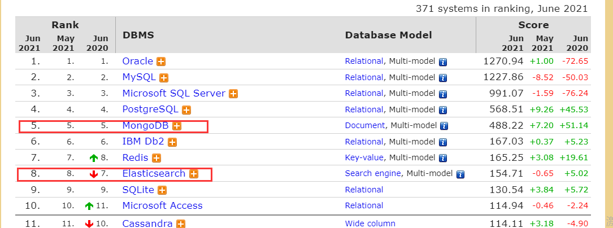

## scala

```xml
<!-- https://mvnrepository.com/artifact/org.mongodb.scala/mongo-scala-driver -->
<dependency>
    <groupId>org.mongodb.scala</groupId>
    <artifactId>mongo-scala-driver_${scala.version}</artifactId>
    <version>4.2.3</version>
</dependency>
```

TIPs

> 1. Document有两种：immutable和mutable；immutable document插入时如果不指定_id,系统会自动分配，且不会返回给用户。
>
> 2. 所有的方法会的是 `Observables`对象，这是一种 “cold” streams ，并不会立即执行，直至它被subscribed。

构建Document:

> `scala`数据类型转`Bson`数据类型

```scala
def mapToDocument(obj: Map[String, Any]): Document = Document(mapToBsonDocument(obj))

def mapToBsonDocument(obj: Map[String, Any]): BsonDocument = BsonDocument(obj.map(writePair))

    /**
      * 数据格式转换
      *
      * @param p scala/java Map
      * @return String->BsonValue pair
      */
def writePair(p: (String, Any)): (String, BsonValue) = (p._1, p._2 match {
    case value: String => BsonString(value)
    case value: Double => BsonDouble(value)
    case value: Int => BsonInt32(value)
    case value: Boolean => BsonBoolean(value)
    case value: Long => BsonInt64(value)
    case value: Date => BsonDateTime(value.getTime)
    case value: DateTime => BsonDateTime(value.getMillis)
    case value: Map[String, Any] => mapToBsonDocument(value)
    case other => BsonNull()
})
```


## flink写入


## 数据迁移


## 性能对比

| ES   | Mongo |
| ---- | :---- |
|      |       |
|      |       |
|      |       |

