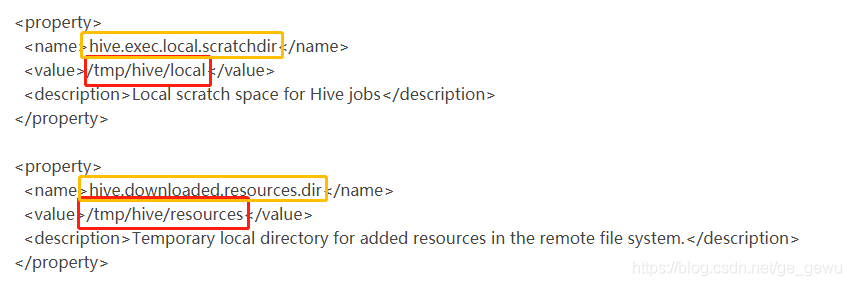
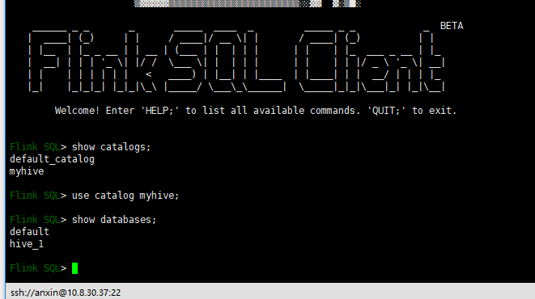
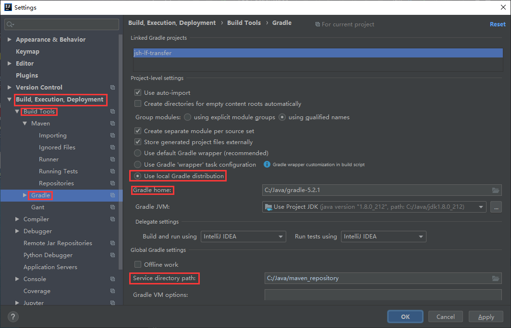
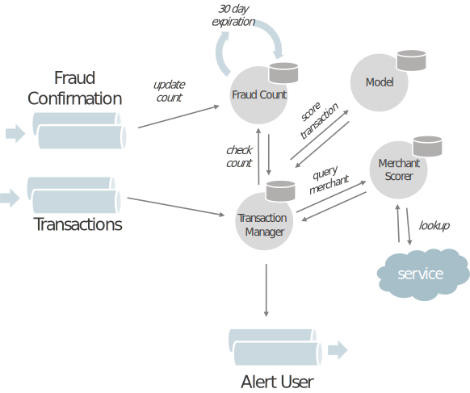

## Home

关键参考位置：

>  [Flink继承Iceberg简介](https://www.cnblogs.com/swordfall/p/14548574.html) 

>  [Flink + Iceberg: How to Construct a Whole-scenario Real-time Data Warehouse](https://www.alibabacloud.com/blog/flink-%2B-iceberg-how-to-construct-a-whole-scenario-real-time-data-warehouse_597824) 
>
>  [Flink 如何实时分析 Iceberg 数据湖的 CDC 数据](https://blog.csdn.net/huzechen/article/details/114109363)


数据湖是什么：

以下内容摘自 https://www.sohu.com/a/403477409_411876

1. Databricks 和 `Delta`

2. Uber 和 `Apache Hudi`

3. Netflix和 `Apache Iceberg`

数据湖痛点：


优劣：


选型Ⅰ ：

## Apache Iceberg


**Apache Iceberg is an open table format for huge analytic datasets.** 


> 先了解下HADOOP生态：

HADOOP： 一个生态，包含很多组件。

HDFS:  HADOOP分布式文件系统。[深入理解HDFS](https://blog.csdn.net/sjmz30071360/article/details/79877846)

PIG：一种数据流语言。可以处理HDFS和HBase上的数据，和Hive一样，可以高效的实现数据的查询和处理。

HBase: 建立在HDFS之上，列存储数据库（NOSQL）。弥补Hadoop对实时操作的缺陷的项目 。

Hive: hive是基于[Hadoop](https://baike.baidu.com/item/Hadoop/3526507)的一个[数据仓库](https://baike.baidu.com/item/数据仓库/381916)工具，用来进行数据提取、转化、加载，这是一种可以存储、查询和分析存储在Hadoop中的大规模数据的机制。hive数据仓库工具能将结构化的数据文件映射为一张数据库表，并提供[SQL](https://baike.baidu.com/item/SQL/86007)查询功能，能将[SQL语句](https://baike.baidu.com/item/SQL语句/5714895)转变成[MapReduce](https://baike.baidu.com/item/MapReduce/133425)任务来执行。

MapReduce：*MapReduce*是一种编程模型，用于大规模数据集（大于1TB）的并行运算。

YARN：一种新的 Hadoop [资源管理器](https://baike.baidu.com/item/资源管理器/1951545)，基于yarn可以部署spark、tez等计算引擎。

Tez：*Tez*是Apache开源的支持DAG作业的计算框架,它直接源于MapReduce框架

Storm：流式处理框架 （和Hadoop强调批处理相反，实时性高）

Spark：Apache Spark 是专为大规模[数据处理](https://baike.baidu.com/item/数据处理/944504)而设计的快速通用的计算引擎。Spark是UC Berkeley AMP lab ([加州大学伯克利分校](https://baike.baidu.com/item/加州大学伯克利分校/3755024)的AMP实验室)所开源的类Hadoop MapReduce的通用并行框架


>  其他概念：

CDC: Change Data Capture 即变化数据捕获。大数据库的备份操作，如MySql提供Binlog（Binary Log）启动基于日志的CDC


### **安装HIVE**

https://cwiki.apache.org/confluence/display/Hive/GettingStarted#GettingStarted-InstallationandConfiguration

参考[博文](https://blog.csdn.net/weixin_43861175/article/details/90372513)

Step by step >>>

在157测试环境


环境准备：

> '>java 1.7 
>
> Hadoop 3.1  (HADOOP_HOME)


[Download hive](http://www.apache.org/dyn/closer.cgi/hive/)  [【3.1.2】](https://ftp.acc.umu.se/mirror/apache.org/hive/hive-3.1.2/)


```shell
$ tar -xzvf hive-x.y.z.tar.gz
$ cd hive-x.y.z
$ export HIVE_HOME={{pwd}}
$ export PATH=$HIVE_HOME/bin:$PATH

export HADOOP_HOME=${HADOOP_HOME:-/usr/hdp/3.1.4.0-315/hadoop}

 $ $HADOOP_HOME/bin/hadoop fs -mkdir       /tmp
 $ $HADOOP_HOME/bin/hadoop fs -mkdir       /user/hive/warehouse
 $ $HADOOP_HOME/bin/hadoop fs -chmod g+w   /tmp
 $ $HADOOP_HOME/bin/hadoop fs -chmod g+w   /user/hive/warehouse
 
 # run HIVE CLI
 $HIVE_HOME/bin/hive
 
 vi /etc/profile
 """
 export HIVE_HOME=/home/anxin/apache-hive-3.1.2-bin
 export PATH=$HIVE_HOME/bin:$PATH
 """
 hive --version
 
 #启动报错 com.google.common.base.Preconditions.checkArgument
#: guava包冲突
rm lib/guava-19.0.jar
cp /usr/hdp/3.1.4.0-315/hadoop/lib/guava-28.0-jre.jar /home/anxin/apache-hive-3.1.2-bin/lib/

# 修改配置
mv hive-default.xml.template hive-site.xml

```

hive-site.xml 中添加数据库连接属性

通过vi命令 输入 `/abc`进行查找 `N`查找下一条

配置文件里有一行报错，输入 `:n`跳转到指定第n行。

```xml
<?xml version="1.0" encoding="UTF-8" standalone="no"?><?xml-stylesheet type="text/xsl" href="configuration.xsl"?>
<configuration>
    <property>
        <name>javax.jdo.option.ConnectionUserName</name>
        <value>root</value>
    </property>
    <property>
        <name>javax.jdo.option.ConnectionPassword</name>
        <value>123456</value>
    </property>
    <property>
        <name>javax.jdo.option.ConnectionURL</name>
        <value>jdbc:mysql://10.8.30.157:3305/metastore_db?createDatabaseIfNotExist=true</value>
    </property>
    <property>
        <name>javax.jdo.option.ConnectionDriverName</name>
        <value>com.mysql.jdbc.Driver</value>
    </property>
    <property>
        <name>hive.metastore.schema.verification</name>
        <value>false</value>
    </property>
    <property>
        <name>hive.cli.print.current.db</name>
        <value>true</value>
    </property>
    <property>
        <name>hive.cli.print.header</name>
        <value>true</value>
    </property>

    <!-- hiveserver2 -->
    <property>
        <name>hive.server2.thrift.port</name>
        <value>10000</value>
    </property>
    <property>
        <name>hive.server2.thrift.bind.host</name>
        <value>10.8.30.37</value>
    </property>
</configuration>
```

下载mysql驱动

https://downloads.mysql.com/archives/c-j/

```shell
sudo dpkg -i mysql-connector-java_8.0.25-1ubuntu16.04_all.deb
cp /usr/share/java/mysql-connector-java-8.0.25.jar $HIVE_HOME/lib
```


`Exception in thread "main" java.lang.IllegalArgumentException: java.net.URISyntaxException: Relative path in absolute URI: ${system:java.io.tmpdir%7D/$%7Bsystem:user.name%7D`




```shell
$HIVE_HOME/bin/schematool -dbType mysql -initSchema

$HIVE_HOME/bin/hiveserver2

root@node37:/home/anxin/apache-hive-3.1.2-bin# hive
SLF4J: Class path contains multiple SLF4J bindings.
SLF4J: Found binding in [jar:file:/home/anxin/apache-hive-3.1.2-bin/lib/log4j-slf4j-impl-2.10.0.jar!/org/slf4j/impl/StaticLoggerBinder.class]
SLF4J: Found binding in [jar:file:/usr/hdp/3.1.4.0-315/hadoop/lib/slf4j-log4j12-1.7.25.jar!/org/slf4j/impl/StaticLoggerBinder.class]
SLF4J: See http://www.slf4j.org/codes.html#multiple_bindings for an explanation.
SLF4J: Actual binding is of type [org.apache.logging.slf4j.Log4jLoggerFactory]
Hive Session ID = f02a15a1-7faa-4a4f-bf50-d1889082a36f

Logging initialized using configuration in jar:file:/home/anxin/apache-hive-3.1.2-bin/lib/hive-common-3.1.2.jar!/hive-log4j2.properties Async: true
Loading class `com.mysql.jdbc.Driver'. This is deprecated. The new driver class is `com.mysql.cj.jdbc.Driver'. The driver is automatically registered via the SPI and manual loading of the driver class is generally unnecessary.
Hive-on-MR is deprecated in Hive 2 and may not be available in the future versions. Consider using a different execution engine (i.e. spark, tez) or using Hive 1.X releases.
Hive Session ID = ed686748-4415-4c87-a7ab-c3790728c161
hive> create database hive_1;
OK
Time taken: 0.96 seconds
hive> show databases;
OK
default
hive_1
Time taken: 1.343 seconds, Fetched: 2 row(s)
```


HiveServer2

HiveServer2（HS2）是一个服务端接口，使远程客户端可以执行对Hive的查询并返回结果。目前基于Thrift RPC的实现是HiveServer的改进版本，并支持多客户端并发和身份验证.

Beeline 是HiveServer2自己的CLI。启动beeline：

```shell
$HIVE_HOME/bin/beeline -u  jdbc:hive2://10.8.30.37:10000
```

启动报错：

```shell
Connecting to jdbc:hive2://node37:10000
21/08/16 14:54:17 WARN jdbc.HiveConnection: Failed to connect to node37:10000
Error: Could not open client transport with JDBC Uri: jdbc:hive2://node37:10000: Failed to open new session: java.lang.RuntimeException: org.apache.hadoop.ipc.RemoteException(org.apache.hadoop.security.authorize.AuthorizationException): Unauthorized connection for super-user: root from IP 10.8.30.37 (state=08S01,code=0)
Beeline version 3.1.2 by Apache Hive
```

授权失败，修改hdfs的proxy.user权限（通过ambari）


通过10002端口访问


同时启动hiveserver2和beeline测试：

```shell
$HIVE_HOME/bin/beeline -u  jdbc:hive2://
Connected to: Apache Hive (version 3.1.2)
Driver: Hive JDBC (version 3.1.2)
Transaction isolation: TRANSACTION_REPEATABLE_READ
Beeline version 3.1.2 by Apache Hive
0: jdbc:hive2://> 
0: jdbc:hive2://> show databases;
OK
+----------------+
| database_name  |
+----------------+
| default        |
| hive_1         |
+----------------+
2 rows selected (2.095 seconds)
0: jdbc:hive2://> CREATE TABLE pokes (foo INT, bar STRING);
OK
No rows affected (1.59 seconds)
0: jdbc:hive2://> show tables;
OK
+-----------+
| tab_name  |
+-----------+
| pokes     |
+-----------+
1 row selected (0.215 seconds)
```


hiveserver的访问方式

  1   hive 命令行模式，直接输入/hive/bin/hive的[执行程序](https://www.baidu.com/s?wd=执行程序&tn=44039180_cpr&fenlei=mv6quAkxTZn0IZRqIHckPjm4nH00T1Y3rywWPHTsujTYnjDdPH9b0ZwV5Hcvrjm3rH6sPfKWUMw85HfYnjn4nH6sgvPsT6KdThsqpZwYTjCEQLGCpyw9Uz4Bmy-bIi4WUvYETgN-TLwGUv3ErHnLPjbLn1m1P1b4rHbsnHTz)，或者输入 hive --service cli

  2  hive web界面的 (端口号9999) 启动方式 hive –service hwi & 用于通过浏览器来访问hive，感觉没多大用途

 3  hive 远程服务 (端口号10000) 启动方式

   hive --service hiveserver & 或者 hive --service hiveserver 10000>/dev/null 2>/dev/null &

  beeline方式连接：beeline -u jdbc:hive2//localhost:10000/default -n root -p 123456  或者java client方式连接

  备注：连接Hive JDBC URL：jdbc:hive://192.168.6.116:10000/default   （Hive默认端口：10000; 默认数据库名：default）


作者：jero_lei
链接：https://www.jianshu.com/p/45ca74ec1e3f
来源：简书
著作权归作者所有。商业转载请联系作者获得授权，非商业转载请注明出处。


### Flink中使用IceBerg

#### Flink SQL

[参考] https://www.cxyzjd.com/article/xuronghao/109764018

[官网] https://iceberg.apache.org/flink/

[Tecent实践]https://www.alibabacloud.com/blog/flink-%2B-iceberg-how-to-construct-a-whole-scenario-real-time-data-warehouse_597824


下载flink 1.11 建议scala 2.12

https://flink.apache.org/downloads.html

设置HADOOP_HOME以及HADOOP_CLASSPATH: `/etc/profile`

```shell
export HADOOP_HOME=/usr/hdp/3.1.4.0-315/hadoop
export HADOOP_CLASSPATH=`$HADOOP_HOME/bin/hadoop classpath`
```


启动基于hadoop环境的standalone模式：

```shell
./bin/start-cluster.sh
```

启动flink sql client

```shell
./bin/sql-client.sh embedded \
    -j /home/anxin/iceberg/iceberg-flink-runtime-0.12.0.jar \
    -j /home/anxin/iceberg/flink-sql-connector-hive-2.3.6_2.11-1.11.0.jar \
    -j /home/anxin/flink-1.11.4/lib/flink-sql-connector-kafka-0.11_2.11-1.11.4.jar \
    shell
```

 


创建catalog

```sql
CREATE CATALOG hive_catalog WITH (
  'type'='iceberg',
  'catalog-type'='hive',
  'uri'='thrift://10.8.30.37:9083',
  'clients'='5',
  'property-version'='1',
  'warehouse'='hdfs://node37:8020/user/hive/warehouse'
);
```

创建Hive Catalog一直失败，尝试另外一种[方法]( https://jiamaoxiang.top/2020/12/21/Flink%E9%9B%86%E6%88%90Hive%E4%B9%8BHive-Catalog%E4%B8%8EHive-Dialect-%E4%BB%A5Flink1-12%E4%B8%BA%E4%BE%8B/#Flink-SQLCli%E4%B8%AD%E4%BD%BF%E7%94%A8Hive-Catalog), 如下：

修改Flink SQL中配置文件 `conf/sql-client-defaults.yaml`

```yaml
#==============================================================================
# Catalogs
#==============================================================================

# Define catalogs here.
catalogs:
  - name: myhive
    type: hive
    default-database: default
    hive-conf-dir: /home/anxin/apache-hive-3.1.2-bin/conf
```

flink启动sql-client.sh embedded报错 `Make sure you have set a valid value for hive.metastore.uris`

配置hive-site.xml

```xml
<property>
        <name>hive.metastore.warehouse.dir</name>
        <value>/user/hive/warehouse</value>
</property>

<property>
        <name>hive.metastore.local</name>
        <value>false</value>
</property>

<property>
        <name>hive.metastore.uris</name>
        <value>thrift://10.8.30.37:9083</value>
</property>
```

执行sql-client.sh embedded继续报错：

```shell
2021-08-17 15:22:17,994 WARN  org.apache.hadoop.hive.metastore.RetryingMetaStoreClient     [] - MetaStoreClient lost connection. Attempting to reconnect (1 of 1) after 1s. getDatabase
```


原因是我们没有启动HSM：

```shell
root@node37:/home/anxin/apache-hive-3.1.2-bin/conf# hive --service metastore
2021-08-17 15:27:28: Starting Hive Metastore Server
```

再执行sql-client.sh embedded成功：




DLL 

```sql
create database iceberg_db;
use iceberg_db;

CREATE TABLE sample (
    id BIGINT,
    data STRING
);
```


创建一张连接kafka的表

```sql
CREATE TABLE anxinyun_data ( 
    `userId` STRING, -- 用户id
    `thingId` STRING,
    `deviceId` STRING,
    `taskId` STRING,
    `dimensionId` STRING,
    -- `nw` AS PROCTIME(), -- 通过计算列产生一个处理时间列
    `triggerTime` DATE
    -- `triggerTime` AS TO_TIMESTAMP(FROM_UNIXTIME(ts, 'yyyy-MM-ddTHH:mm:ss.SSS')) -- 事件时间
 ) WITH ( 
    'connector' = 'kafka-0.10', -- 使用 kafka connector
    'topic' = 'anxinyun_data4', -- kafka主题
    'scan.startup.mode' = 'earliest-offset', -- 偏移量
    'properties.group.id' = 'flink.sql', -- 消费者组
    'properties.bootstrap.servers' = '10.8.30.37:6667,10.8.30.38:6667,10.8.30.156:6667', 
    'format' = 'json', -- 数据源格式为json
    'json.fail-on-missing-field' = 'false',
    'json.ignore-parse-errors' = 'false',
    'is_generic' = 'false' -- 创建HIVE兼容表
);
```

需要下载kafka-connect包到flink-sql的classpath下：

`flink-sql-connector-kafka-0.11_2.11-1.11.4.jar`


在Hive中查看该表的元数据：

```shell
hive (default)> desc formatted anxinyun_data;
OK
col_name	data_type	comment
# col_name            	data_type           	comment             
	 	 
# Detailed Table Information	 	 
Database:           	default             	 
OwnerType:          	USER                	 
Owner:              	null                	 
CreateTime:         	Tue Aug 17 15:48:22 CST 2021	 
LastAccessTime:     	UNKNOWN             	 
Retention:          	0                   	 
Location:           	hdfs://node37:8020/user/hive/warehouse/anxinyun_data	 
Table Type:         	MANAGED_TABLE       	 
Table Parameters:	 	 
	flink.connector     	kafka-0.10          
	flink.format        	json                
	flink.json.fail-on-missing-field	false               
	flink.json.ignore-parse-errors	false               
	flink.properties.bootstrap.servers	10.8.30.37:6667,10.8.30.38:6667,10.8.30.156:6667
	flink.properties.group.id	flink.sql           
	flink.scan.startup.mode	earliest-offset     
	flink.schema.0.data-type	VARCHAR(2147483647) 
	flink.schema.0.name 	userId              
	flink.schema.1.data-type	VARCHAR(2147483647) 
	flink.schema.1.name 	thingId             
	flink.schema.2.data-type	VARCHAR(2147483647) 
	flink.schema.2.name 	deviceId            
	flink.schema.3.data-type	VARCHAR(2147483647) 
	flink.schema.3.name 	taskId              
	flink.schema.4.data-type	VARCHAR(2147483647) 
	flink.schema.4.name 	dimensionId         
	flink.schema.5.data-type	TIMESTAMP(3) NOT NULL
	flink.schema.5.expr 	PROCTIME()          
	flink.schema.5.name 	nw                  
	flink.schema.6.data-type	DATE                
	flink.schema.6.name 	triggerTime         
	flink.topic         	anxinyun_data4      
	**********
	is_generic          	true
	**********
	transient_lastDdlTime	1629186502          
	 	 
# Storage Information	 	 
SerDe Library:      	org.apache.hadoop.hive.serde2.lazy.LazySimpleSerDe	 
InputFormat:        	org.apache.hadoop.mapred.TextInputFormat	 
OutputFormat:       	org.apache.hadoop.hive.ql.io.IgnoreKeyTextOutputFormat	 
Compressed:         	No                  	 
Num Buckets:        	-1                  	 
Bucket Columns:     	[]                  	 
Sort Columns:       	[]                  	 
Storage Desc Params:	 	 
	serialization.format	1                   
Time taken: 1.764 seconds, Fetched: 48 row(s)
hive (default)> 

```


执行select时候出错：

Caused by: java.lang.ClassNotFoundException: org.apache.hadoop.security.Credentials

后面没有遇到该错误了。


```sql
CREATE TABLE anxinyun_data ( 
    `userId` STRING, -- 用户id
    `thingId` STRING,
    `deviceId` STRING,
    `taskId` STRING,
    `dimensionId` STRING,
    -- `nw` AS PROCTIME(), -- 通过计算列产生一个处理时间列
    `triggerTime` DATE
    -- `triggerTime` AS TO_TIMESTAMP(FROM_UNIXTIME(ts, 'yyyy-MM-ddTHH:mm:ss.SSS')) -- 事件时间
 ) WITH ( 
    'connector' = 'kafka-0.10', -- 使用 kafka connector
    'topic' = 'anxinyun_data4', -- kafka主题
    'scan.startup.mode' = 'earliest-offset', -- 偏移量
    'properties.group.id' = 'flink.sql', -- 消费者组
    'properties.bootstrap.servers' = '10.8.30.37:6667,10.8.30.38:6667,10.8.30.156:6667', 
    'format' = 'json', -- 数据源格式为json
    'json.fail-on-missing-field' = 'false',
    'json.ignore-parse-errors' = 'false',
    'is_generic' = 'false' -- 创建HIVE兼容表
);
```


#### 启动步骤总结

```shell
# sudo su
# 如果报错先执行下 source /etc/profile 更新下环境变量
$HIVE_HOME/bin/hive --service metastore
$HIVE_HOME/bin/hiveserver2

./bin/sql-client.sh embedded \
    -j /home/anxin/iceberg/iceberg-flink-runtime-0.12.0.jar \
    -j /home/anxin/iceberg/flink-sql-connector-hive-2.3.6_2.11-1.11.0.jar \
    -j /home/anxin/flink-1.11.4/lib/flink-sql-connector-kafka-0.11_2.11-1.11.4.jar \
    shell
    
    
./bin/sql-client.sh embedded \
    -j /home/anxin/flink-1.11.4/iceberg-flink-runtime-0.11.1.jar \
    -j /home/anxin/flink-1.11.4/flink-sql-connector-hive-2.3.6_2.11-1.11.0.jar \
    -j /home/anxin/flink-1.11.4/lib/flink-sql-connector-kafka-0.11_2.11-1.11.4.jar \
    -j /home/anxin/flink-1.11.4/hadoop-common-2.8.3.jar \
    shell
    
  
CREATE CATALOG hive_catalog WITH (
  'type'='iceberg',
  'catalog-type'='hive',
  'uri'='thrift://10.8.30.37:9083',
  'clients'='5',
  'property-version'='1',
  'warehouse'='hdfs://node37:8020/user/hive/warehouse'
);

use catalog hive_catalog;

create database iceberg_db1;
use iceberg_db1;
```


基于Hadoop Catalog：


#### Flink 代码


## Apache Hudi

[官网](https://hudi.apache.org/)    [Github](https://github.com/apache/hudi)   [中文概念](https://hudi.apache.org/cn/docs/0.8.0/overview) 

[Hudi在顺丰中应用](https://www.jianshu.com/p/0f5a781607cf)

Hudi brings transactions, record-level updates/deletes and change streams to data lakes!

提供业务处理，记录级别的更新、删除，引入流到数据湖。

Hudi is a rich platform to build streaming data lakes with incremental data pipelines
on a self-managing database layer, while being optimized for lake engines and regular batch processing.

Hudi自我管理的数据库层提供增量数据管道，建立流数据数据湖平台，并已在通用的数据湖引擎和批处理上优化。


数据湖[Hudi](https://www.cnblogs.com/zackstang/p/11912994.html) 是基于 HDFS/S3存储之上的提供两种流原语“插入更新”、”增量拉取“。

存储类型：写时复制(copy on write)和读时合并(merge on read); 其中读时合并使用列式（parquet）和行式（avro）文件组合，在更新记录时，更新到增量文件avro中，读取数据时，需要将增量文件与旧文件进行合并，生成列式文件parquet。

视图：读优化视图(Read Optimized View)、增量视图(Incremental View)、实时视图（Real-Time View）。

时间轴：Hudi中的重要概念。每次执行操作(写入、删除、合并)时，均会带一个时间戳。可以仅查询某个时间点之后/前的数据


[Flink Quick Start](https://hudi.apache.org/docs/flink-quick-start-guide)

测试环境：10.8.30.39

> 安装Hadoop 2.10 （官网说hadoop2.8.*+）

https://hadoop.apache.org/docs/r1.0.4/cn/quickstart.html 伪分布模式

确保免密ssh检查 `ssh localhost`.

不行的话执行

```shell
ssh-keygen -t dsa -P '' -f ~/.ssh/id_dsa
cat ~/.ssh/id_dsa.pub >> ~/.ssh/authorized_keys
```

./etc/hadoop/hadoop-env.sh中添加JAVA_HOME地址

修改core-site.xml

```xml

<configuration>
  <property>
    <name>fs.default.name</name>
    <value>localhost:9000</value>
  </property>
  <property>
    <name>mapred.job.tracker</name>
    <value>localhost:9001</value>
  </property>
  <property>
    <name>dfs.replication</name>
    <value>1</value>
  </property>
</configuration>
```

启动hadoop服务

```shell
bin/hadoop namenode -format
./sbin/start-all.sh
```

访问 NameNode http://10.8.30.39:50070 , JobTracker http://10.8.30.39:50030

验证

```shell
# /etc/profile
export HADOOP_HOME=/home/anxin/hudi/hadoop-2.10.1
export HADOOP_CLASSPATH=`$HADOOP_HOME/bin/hadoop classpath`
export PATH=$PATH:$HADOOP_HOME/bin


hdfs dfs -mkdir hdfs://localhost:9000/user/root/input
hdfs dfs -put etc input
```


> 使用Flink SQL

启动flink集群: 

```shell
# flink-conf.yaml
taskmanager.numberOfTaskSlots: 4
# workers
添加4个localhost客户端
# 启动flink cluster
./bin/start-cluster.sh
```

访问http://10.8.30.39:8081/#/overview


现在[flink-hudi-bundle](https://repo.maven.apache.org/maven2/org/apache/hudi/hudi-flink-bundle_2.11/)库 

```shell
source /etc/profile

./bin/sql-client.sh embedded -j ./hudi-flink-bundle_2.11-0.8.0.jar \
	shell

# SQL

set execution.result-mode=tableau;

CREATE TABLE t2(
  uuid VARCHAR(20),
  name VARCHAR(10),
  age INT,
  ts TIMESTAMP(3),
  `partition` VARCHAR(20)
)
PARTITIONED BY (`partition`)
WITH (
  'connector' = 'hudi',
  'path' = 'hdfs://10.8.30.117:9000/user/yww08/warehouse',
  'table.type' = 'MERGE_ON_READ' -- this creates a MERGE_ON_READ table, by default is COPY_ON_WRITE
);

INSERT INTO t2 VALUES ('id1','Danny',23,TIMESTAMP '1970-01-01 00:00:01','par1');
# 1报错(拒绝连接: localhost/127.0.0.1:8081, 查看flink) java.lang.ClassNotFoundException: org.apache.hudi.config.HoodieCompactionConfig
# 2报错 更换为flink-1.11_2.12报错 java.lang.ClassNotFoundException: org.apache.flink.table.connector.sink.DataStreamSinkProvider
# 3 尝试 flink-1.11.4-bin-scala_2.11 报错同上
# 4 使用Flink 1.12 并配合使用 bundle包(0.8.0,非最新的0.9.0)任务正常提交，但是flink执行错误
#   查看flink日志：
        java.lang.AbstractMethodError: Method org/apache/hudi/sink/StreamWriteOperatorCoordinator.subtaskReady(ILorg/apache/flink/runtime/operators/coordination/OperatorCoordinator$SubtaskGateway;)V is abstract
            at org.apache.hudi.sink.StreamWriteOperatorCoordinator.subtaskReady(StreamWriteOperatorCoordinator.java) ~[?:?]
            at org.apache.flink.runtime.operators.coordination.OperatorCoordinatorHolder.notifySubtaskReady(OperatorCoordinatorHolder.java:419) ~[flink-dist_2.11-1.12.5.jar:1.12.5]
#    搜索有人回复 必须使用 flink 1.11.2
# 5. 尝试使用Flink 1.11.2和bundle 0.8.0:  TNND 好了

select * from t1;
#### RETURN
2021-09-07 09:39:40,464 INFO  org.apache.hadoop.conf.Configuration.deprecation             [] - mapred.job.map.memory.mb is deprecated. Instead, use mapreduce.map.memory.mb
+-----+----------------------+----------------------+-------------+-------------------------+----------------------+
| +/- |                 uuid |                 name |         age |                      ts |            partition |
+-----+----------------------+----------------------+-------------+-------------------------+----------------------+
|   + |                  id1 |                Danny |          23 |     1970-01-01T00:00:01 |                 par1 |
+-----+----------------------+----------------------+-------------+-------------------------+----------------------+
Received a total of 1 rows


## Update操作
insert into t1 values ('id1','Danny',28,TIMESTAMP '1970-01-01 00:00:01','par1');
```

主要需要解决版本冲突，尝试了N多后： **Flink 1.11.2和bundle 0.8.0**

可以在Flink UI中看到提交的插入和查询操作：


```shell
# Streaming 流式查询
CREATE TABLE t1(
  uuid VARCHAR(20),
  name VARCHAR(10),
  age INT,
  ts TIMESTAMP(3),
  `partition` VARCHAR(20)
)
PARTITIONED BY (`partition`)
WITH (
  'connector' = 'hudi',
  'path' = 'hdfs://localhost:9000/user/root/warehouse',
  'table.type' = 'MERGE_ON_READ', -- this creates a MERGE_ON_READ table, by default is COPY_ON_WRITE
  'read.streaming.enabled' = 'true',  -- 使能流读取
  'read.streaming.start-commit' = '20210316134557', -- 指定开始提交的时刻
  'read.streaming.check-interval' = '4' -- 检查新的提交源间隔,默认60s.
);
```

数据分为 Snapshot Data 和 Incremental Data


Flink 代码实现入湖操作：

`POM.xml`

```xml

    <properties>
        <project.build.sourceEncoding>UTF-8</project.build.sourceEncoding>
        <flink.version>1.11.0</flink.version>
        <avro.version>1.8.2</avro.version>
        <java.version>1.8</java.version>
        <kubernetes.client.version>4.9.2</kubernetes.client.version>
        <scala.binary.version>2.11</scala.binary.version>
        <hadoop.version>2.8.2</hadoop.version>
        <maven.compiler.source>${java.version}</maven.compiler.source>
        <maven.compiler.target>${java.version}</maven.compiler.target>
        <hudi.version>0.8.0</hudi.version>
    </properties>

    <dependencies>
        <dependency>
            <groupId>org.apache.flink</groupId>
            <artifactId>flink-connector-kafka_${scala.binary.version}</artifactId>
            <version>${flink.version}</version>
        </dependency>
        <dependency>
            <groupId>org.apache.hudi</groupId>
            <artifactId>hudi-flink-bundle_${scala.binary.version}</artifactId>
            <version>${hudi.version}</version>
        </dependency>
        <!-- Apache Flink dependencies -->
        <!-- These dependencies are provided, because they should not be packaged into the JAR file. -->
        <dependency>
            <groupId>org.apache.flink</groupId>
            <artifactId>flink-java</artifactId>
            <version>${flink.version}</version>
        </dependency>
        <dependency>
            <groupId>org.apache.flink</groupId>
            <artifactId>flink-streaming-java_${scala.binary.version}</artifactId>
            <version>${flink.version}</version>
        </dependency>


        <dependency>
            <groupId>org.apache.flink</groupId>
            <artifactId>flink-table-planner_${scala.binary.version}</artifactId>
            <version>${flink.version}</version>
            <exclusions>
                <exclusion>
                    <groupId>com.google.guava</groupId>
                    <artifactId>guava</artifactId>
                </exclusion>
            </exclusions>
        </dependency>
        <dependency>
            <groupId>org.apache.flink</groupId>
            <artifactId>flink-table-planner-blink_${scala.binary.version}</artifactId>
            <version>${flink.version}</version>
        </dependency>


        <dependency>
            <groupId>org.apache.flink</groupId>
            <artifactId>flink-yarn_${scala.binary.version}</artifactId>
            <version>${flink.version}</version>
        </dependency>

        <dependency>
            <groupId>org.apache.flink</groupId>
            <artifactId>flink-cep_${scala.binary.version}</artifactId>
            <version>${flink.version}</version>
        </dependency>

        <dependency>
            <groupId>org.apache.flink</groupId>
            <artifactId>flink-csv</artifactId>
            <version>${flink.version}</version>
        </dependency>

        <dependency>
            <groupId>org.slf4j</groupId>
            <artifactId>slf4j-log4j12</artifactId>
            <version>1.7.7</version>
        </dependency>
        <dependency>
            <groupId>log4j</groupId>
            <artifactId>log4j</artifactId>
            <version>1.2.17</version>
        </dependency>

        <dependency>
            <groupId>io.fabric8</groupId>
            <artifactId>kubernetes-client</artifactId>
            <version>${kubernetes.client.version}</version>
        </dependency>

        <dependency>
            <groupId>com.google.guava</groupId>
            <artifactId>guava</artifactId>
            <version>23.0</version>
        </dependency>
        <dependency>
            <groupId>mysql</groupId>
            <artifactId>mysql-connector-java</artifactId>
            <version>8.0.16</version>
        </dependency>

        <dependency>
            <groupId>org.apache.flink</groupId>
            <artifactId>flink-orc_${scala.binary.version}</artifactId>
            <version>${flink.version}</version>
        </dependency>

        <dependency>
            <groupId>org.apache.flink</groupId>
            <artifactId>flink-connector-hive_${scala.binary.version}</artifactId>
            <version>${flink.version}</version>
        </dependency>

        <dependency>
            <groupId>org.apache.avro</groupId>
            <artifactId>avro</artifactId>
            <version>${avro.version}</version>
        </dependency>

        <dependency>
            <groupId>org.apache.hive</groupId>
            <artifactId>hive-exec</artifactId>
            <version>3.1.2</version>
            <exclusions>
                <exclusion>
                    <groupId>org.apache.avro</groupId>
                    <artifactId>avro</artifactId>
                </exclusion>
            </exclusions>
        </dependency>

        <dependency>
            <groupId>org.apache.hadoop</groupId>
            <artifactId>hadoop-common</artifactId>
            <version>${hadoop.version}</version>
            <!--<scope>provided</scope>-->
        </dependency>
        <dependency>
            <groupId>org.apache.hadoop</groupId>
            <artifactId>hadoop-hdfs</artifactId>
            <version>${hadoop.version}</version>
            <!--<scope>provided</scope>-->
        </dependency>


        <dependency>
            <groupId>org.apache.hadoop</groupId>
            <artifactId>hadoop-yarn-client</artifactId>
            <version>${hadoop.version}</version>
        </dependency>

        <dependency>
            <groupId>org.apache.hadoop</groupId>
            <artifactId>hadoop-mapreduce-client-core</artifactId>
            <version>${hadoop.version}</version>
        </dependency>

        <dependency>
            <groupId>org.apache.flink</groupId>
            <artifactId>flink-connector-jdbc_${scala.binary.version}</artifactId>
            <version>${flink.version}</version>
        </dependency>

        <dependency>
            <groupId>org.postgresql</groupId>
            <artifactId>postgresql</artifactId>
            <version>42.2.5</version>
        </dependency>

        <dependency>
            <groupId>org.apache.flink</groupId>
            <artifactId>flink-connector-redis_${scala.binary.version}</artifactId>
            <version>1.1.5</version>
        </dependency>

        <dependency>
            <groupId>junit</groupId>
            <artifactId>junit</artifactId>
            <version>4.13.1</version>
        </dependency>

    </dependencies>
```


```java
public static void main(String[] args) throws Exception {
        StreamExecutionEnvironment bsEnv = StreamExecutionEnvironment.getExecutionEnvironment();
        bsEnv.enableCheckpointing(10000);
        StreamTableEnvironment tenv = StreamTableEnvironment.create(bsEnv);

        Properties opts = new Properties();
        opts.setProperty("bootstrap.servers", "node37:6667,test-n1:6667,test-n2:6667");
        opts.setProperty("group.id", "flink.raw.hudi");
        opts.setProperty("auto.offset.reset", "latest");
        SourceFunction<String> sf = new FlinkKafkaConsumer<String>("anxinyun_data4", new SimpleStringSchema(), opts);
        DataStream<IotaData> dataStream = bsEnv.addSource(sf).map((MapFunction<String, IotaData>) StreamingWriteHudi::parse);

        String warehouse = "hdfs://localhost:9000/user/yww08/warehouse";

        String sql = "CREATE TABLE fs_table (\n" +
            " uuid STRING,\n" +
            "  userId STRING,\n" +
            "  thingId STRING,\n" +
            "  ts TIMESTAMP(3)\n" +
            ") PARTITIONED BY (thingId) WITH (\n" +
            "'connector'='hudi',\n" +
            "  'path'='"+ warehouse+"',\n" +
            "'table.type' = 'MERGE_ON_READ'\n" +
            ")";
        tenv.executeSql(sql);

        tenv.createTemporaryView("raws", dataStream);

        String insertSql = "insert into fs_table select '" + UUID.randomUUID() + "',userId,thingId,ts from raws";
        tenv.executeSql(insertSql);
    }
```

Flink 读取：

```java
private static String warehouse = "hdfs://localhost:9000/user/yww08/warehouse";

    public static void main(String[] args) {
        StreamExecutionEnvironment bsEnv = StreamExecutionEnvironment.getExecutionEnvironment();
        bsEnv.enableCheckpointing(10000);
        StreamTableEnvironment tenv = StreamTableEnvironment.create(bsEnv);

        String printSQL = "create table sink_print(\n" +
            " uuid STRING,\n" +
            " userId STRING,\n" +
            " thingId STRING,\n" +
            " ts TIMESTAMP(3)\n" +
            ") with ('connector'='print')";
        tenv.executeSql(printSQL);

        String sql = "CREATE TABLE fs_table (\n" +
            " uuid STRING,\n" +
            "  userId STRING,\n" +
            "  thingId STRING,\n" +
            "  ts TIMESTAMP(3)\n" +
            ") PARTITIONED BY (thingId) WITH (\n" +
            "'connector'='hudi',\n" +
            "  'path'='" + warehouse + "',\n" +
            "'table.type' = 'MERGE_ON_READ'\n" +
            ")";
        tenv.executeSql(sql);
        tenv.executeSql("insert into sink_print select * from fs_table");
    }
```


其他相关内容学习记录：

## Flink Table API & SQL

[官网](https://ci.apache.org/projects/flink/flink-docs-release-1.13/docs/dev/table/overview/) Flink支持两种关系API （table api和sql）统一处理流和批处理。

引入pom.xml

```xml
<dependency>
  <groupId>org.apache.flink</groupId>
  <artifactId>flink-table-api-scala-bridge_2.11</artifactId>
  <version>1.13.2</version>
  <scope>provided</scope>
</dependency>
```

支持在IDE中运行

```xml
<dependency>
  <groupId>org.apache.flink</groupId>
  <artifactId>flink-table-planner-blink_2.11</artifactId>
  <version>1.13.2</version>
  <scope>provided</scope>
</dependency>
<dependency>
  <groupId>org.apache.flink</groupId>
  <artifactId>flink-streaming-scala_2.11</artifactId>
  <version>1.13.2</version>
  <scope>provided</scope>
</dependency>
```

实现自定义连接器或函数，虚引入

```xml
<dependency>
  <groupId>org.apache.flink</groupId>
  <artifactId>flink-table-common</artifactId>
  <version>1.13.2</version>
  <scope>provided</scope>
</dependency>
```


操作表包括三个部分：Catalog + Database + Object。 table可以是虚拟的（VIEWS）或正常（TABLES）。VIEWS能从存在的Table对象上创建，通常是TableAPI和SQL查询的结果。TABLES描述外部数据，如：一个文件、数据库表格、消息队列。

Tables可以是临时（temporary）或永久的（permanent）.永久的表需要一个catalog可以维护metadata（诸如hive metastore）。永久表可以被其他flink会话使用。临时表存储在内存中，当创建它的会话结束后，即被删除。

可以在永久表上创建一个相同标识的临时表（shadowing），所有查询此ID的操作都将在临时表上执行。这在试验阶段是有用的。

查询

Table API:

```scala
val orders=tenv.from("Orders")
val revenue = orders
	.filter($"cCountry"==="FRANCE")
	.groupBy($"cID",$"cName")
	.select($"cID",$"cName",$"revenue".sum AS "revSum")
```

SQL:

Flink的SQL是基于 [Apache Calcite](https://calcite.apache.org/)，实现SQL标准。

```scala
val revenue = tableEnv.sqlQuery("""
  |SELECT cID, cName, SUM(revenue) AS revSum
  |FROM Orders
  |WHERE cCountry = 'FRANCE'
  |GROUP BY cID, cName
  """.stripMargin)
```

提交：

通过写入TableSink表格被提交。TableSink是支持各种写入的通用接口，如文件格式（CSV/Apache Parquet,Apache Avro) 存储系统（JDBC、Apache HBase、Apache Cassandra，ElasticSearch） 消息系统（Kafka、RabbitMQ）

Table.executeInsert(String tableName)或将表提交到注册的TableSink。

```scala
val schema=new Schema()
    .field("a",DataTypes.INT())
    .field("b",DataTypes.STRING())
    .field("c",DataTypes.BIGINT())

tenv.connect(new FileSystem().path("file/path"))
    .withFormat(new CSV().fieldDelimiter('|').deriveSchema)
    .withSchema(schema)
    .createTemporaryTable("CsvSinkTable")

val result:Table = ...

result.executeInsert("CsvSinkTable")
```


DataStream 集成

```scala
// 创建两个API的环境
val env = StreamExecutionEnvironment.getExecutionEnvironment
val tableEnv = StreamTableEnvironment.create(env)

// create a DataStream
val dataStream = env.fromElements("Alice", "Bob", "John")

// interpret the insert-only DataStream as a Table
val inputTable = tableEnv.fromDataStream(dataStream)

// register the Table object as a view and query it
tableEnv.createTemporaryView("InputTable", inputTable)
val resultTable = tableEnv.sqlQuery("SELECT UPPER(f0) FROM InputTable")

// interpret the insert-only Table as a DataStream again
val resultStream = tableEnv.toDataStream(resultTable)

// add a printing sink and execute in DataStream API
resultStream.print()
env.execute()
```


Changelog Stream

```scala
def main(args: Array[String]): Unit = {
    val env = StreamExecutionEnvironment.getExecutionEnvironment
    val tenv = StreamTableEnvironment.create(env)

    val dataStream = env.fromElements(
        Row.of("Alice", Int.box(10)),
        Row.of("Bob", Int.box(8)),
        Row.of("Alice", Int.box(100))
    )(Types.ROW(Types.STRING, Types.INT))

    val inputTable = tenv.fromDataStream(dataStream).as("name", "score")

    tenv.createTemporaryView("atable", inputTable)
    val resultTalbe = tenv.sqlQuery("select name,SUM(score) from atable group by name")

    // error: doesn't support consuming update changes ....
    // val resultStream = tenv.toDataStream(resultTalbe)

    val resultStream = tenv.toChangelogStream(resultTalbe)
    resultStream.print()
    env.execute()
}
```

Handle Insert-Only Streams

- `fromDataStream(DataStream, Schema)`:  Interprets a stream of insert-only changes and arbitrary type as a table. The optional schema allows to enrich column data types and add time attributes, watermarks strategies, other computed columns, or primary keys.
- `createTemporaryView(String, DataStream)`: Registers the stream under a name to access it in SQL. It is a shortcut for `createTemporaryView(String, fromDataStream(DataStream))`.
- `createTemporaryView(String, DataStream, Schema)`: Registers the stream under a name to access it in SQL. It is a shortcut for `createTemporaryView(String, fromDataStream(DataStream, Schema))`.
- `toDataStream(DataStream)`: Converts a table into a stream of insert-only changes. The default stream record type is `org.apache.flink.types.Row`. A single rowtime attribute column is written back into the DataStream API’s record. Watermarks are propagated as well.
- `toDataStream(DataStream, AbstractDataType)`: Converts a table into a stream of insert-only changes. This method accepts a data type to express the desired stream record type. The planner might insert implicit casts and reorders columns to map columns to fields of the (possibly nested) data type.
- `toDataStream(DataStream, Class)`: A shortcut for `toDataStream(DataStream, DataTypes.of(Class))` to quickly create the desired data type reflectively.

## 安装Gradle

下载的IceBerg源码使用Gradle编译

```
https://services.gradle.org/distributions/gradle-5.4.1-bin.zip
```

设置 环境变量

```shell
GRADLE_HOME=E:\@\gradle-5.4.1
GRADLE_USER_HOME=F:\maven_rep
PATH= %GRADLE_HOME%\bin
```

安装目录下 E:\@\gradle-5.4.1\init.d\init.gradle

```
allprojects {
    repositories {
        maven { url 'file:///C:/Java/maven_repository'}
        mavenLocal()
        maven { name "Alibaba" ; url "https://maven.aliyun.com/repository/public" }
        maven { name "Bstek" ; url "http://nexus.bsdn.org/content/groups/public/" }
        mavenCentral()
    }

    buildscript { 
        repositories { 
            maven { name "Alibaba" ; url 'https://maven.aliyun.com/repository/public' }
            maven { name "Bstek" ; url 'http://nexus.bsdn.org/content/groups/public/' }
            maven { name "M2" ; url 'https://plugins.gradle.org/m2/' }
        }
    }
}
```




Error:No such property: GradleVersion for class: JetGradlePlugin

** 可能是IDEA版本和Gradle插件版本不匹配，未解决。

https://blog.csdn.net/qq_31221735/article/details/89710999


## Flink Stateful Functions

https://www.infoq.cn/article/0xbsdhidulnllpph8vo0

Apache Flink流处理 + FaaS函数即服务

 A Platform-Independent Stateful Serverless Stack


Stateful Functions is an API that simplifies the building of **distributed stateful applications** with a runtime built for **serverless architectures**. It brings together the benefits of stateful stream processing - the processing of large datasets with low latency and bounded resource constraints - along with a runtime for modeling stateful entities that supports location transparency, concurrency, scaling, and resiliency.





支持 Stateful Functions 的运行时是基于 Apache Flink 流处理的。状态保存在流处理引擎中，与计算位于同一位置，并能提供快速且一致的状态访问。状态的持久性和容错性是建立在 Flink 具有鲁棒性的[分布快照模型](https://ci.apache.org/projects/flink/flink-docs-stable/internals/stream_checkpointing.html)上的。


## Spring Cloud

Spring Cloud 介绍

https://zhuanlan.zhihu.com/p/95696180?from_voters_page=true

Flink + Spring Boot

https://www.cnblogs.com/intsmaze/p/14110713.html

服务发现(Eureka) + 负载均衡(Ribbon)